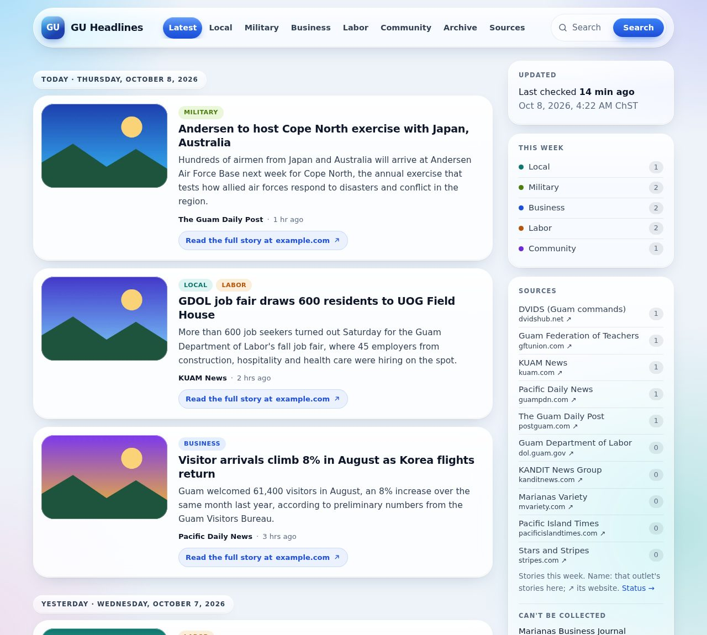

# GU Headlines

Headlines pertaining to the island in one easy source.

GU Headlines is a news website you run yourself. Every hour it visits Guam's
news sites, picks up any **new** stories, and shows them on one page with the
**headline, the story's photo and its first paragraph**. Every story links back
to the news site that published it.

Stories are sorted into four topics, **Local, Military, Business and Labor**,
and everything is kept, so you can search for a story from last week or from
three years ago. Posts from Reddit's r/guam have their own **Community** page,
away from the news.



---

## Start here

New to this? Read these guides in order. No programming experience is
needed; you will copy and paste a few commands.

| Guide | What it covers |
|---|---|
| 1. [Getting started](docs/getting-started.md) | Installing it on your computer or server, step by step |
| 2. [Using the website](docs/using-the-website.md) | Topics, search tips, the archive, the Sources page |
| 3. [Changing settings](docs/settings.md) | Site name, how often it checks for news, photos, the port, and every other setting |
| 4. [News sources](docs/news-sources.md) | Adding, pausing, removing and fixing news websites |
| 5. [Topics](docs/topics.md) | How stories are sorted into Local, Military, Business and Labor (plus Community for r/guam), and how to change or add topics |
| 6. [Looking after it](docs/maintenance.md) | Backups, updates, checking it is healthy, putting it on the internet with your own domain |
| 7. [How it works](docs/how-it-works.md) | Behind the scenes, for the curious and for developers |

---

## The short version

If you already have [Docker](https://docs.docker.com/get-docker/) installed:

```sh
git clone https://github.com/gottalogin1/GU-headlines.git
cd GU-headlines
cp .env.example .env
nano .env                      # change POSTGRES_PASSWORD, then save
docker compose up -d --build
```

Then open **http://localhost:8000** in your browser. The first stories appear
within a few minutes. The full walkthrough is in
[Getting started](docs/getting-started.md).

## Updating to a new version

New versions are listed on the
[Releases page](https://github.com/gottalogin1/GU-headlines/releases), and
[CHANGELOG.md](CHANGELOG.md) says what changed in each. From inside your
`GU-headlines` folder:

```sh
./scripts/backup.sh            # a backup first, just in case
git pull
docker compose up -d --build
```

Your stories, photos and settings are kept. If `git pull` complains about
your local changes, see [Updating](docs/maintenance.md#updating).

---

## What it does

- **Checks every hour** for new stories and downloads only the ones it has
  not seen before. If a site asks it to slow down, it comes back every minute
  until everything is loaded, then returns to hourly.
- **Keeps the photo, headline and first paragraph** of each story. Photos are
  saved on your server, so old stories keep their pictures.
- **Sorts stories into topics** using keyword lists you can edit.
- **Search** finds stories from any date. It understands word endings
  ("workers" finds "worker") and ignores accents ("Hagatna" finds "Hagåtña").
- **Archive** by year, month and day, in Chamorro Standard Time.
- **Community page** for posts from Reddit's r/guam, kept apart from the news.
- **Sources page** shows, for each news site, when it was last checked and
  whether anything went wrong, and lists the sites that can't be collected.
- **Built to last**: a proper database (PostgreSQL), automatic database
  upgrades, a backup script, and settings kept in plain text files.

## The news sites

These are set up out of the box. You can add, pause or remove sites; see
[News sources](docs/news-sources.md).

| News site | Notes |
|---|---|
| The Guam Daily Post | |
| Pacific Daily News | |
| KUAM News | |
| KANDIT News Group | Opinion pieces, obituaries and public notices are skipped |
| Pacific Island Times | Guam stories only |
| Marianas Variety | Guam stories only; loads slowly because the site limits how fast it can be read |
| Stars and Stripes | Guam stories only |
| DVIDS (Joint Region Marianas, Naval Base Guam, Camp Blaz, Andersen) | Military news releases |
| Guam Department of Labor | Posts rarely |
| Guam Federation of Teachers | The union for GDOE, GMH, UOG, GCC and other public workers; posts rarely |
| r/guam on Reddit | Shown only on the **Community** page, not on the front page; read from the community's feed only |
| Office of the Governor | Press releases; switched off unless you turn it on |

**Listed but not collected.** These sites turn away automated visitors, so
GU Headlines doesn't try to read them. The Sources page and the sidebar list
them separately, with links to visit them directly:
- Marianas Business Journal
- Guam Business Magazine
- Andersen Air Force Base

To see whether one has started working, and how to switch it back on, see
[News sources](docs/news-sources.md#sites-that-cant-be-collected).

## Folder guide

```
GU-headlines/
├── .env.example        settings template (you copy it to .env)
├── CHANGELOG.md        what changed in each release
├── config/
│   ├── sources.yaml    the list of news sites
│   └── categories.yaml the topics and their keywords
├── docs/               the guides linked above
├── docker-compose.yml  tells Docker how to run everything
├── scripts/backup.sh   makes a database backup
└── guheadlines/        the program itself (you don't need to touch this)
```

## A note on content

GU Headlines stores only what a reader sees on a news site's front page: the
headline, a short intro and a photo, and every story links to the original
article. Full articles are not copied. If you make your site public, check the
news sites' terms of use, and give credit (the site already names the source
of every story).
